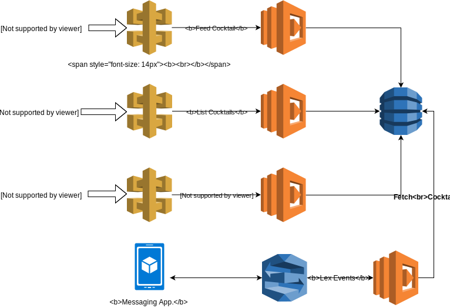

# Serverless Bartender Bot
 


`Serverless Bartender Bot` is a chat-bot powered by `Amazon Lex` and built on top of `Serverless Architecture`.

## Build Project
You can build the project and create a fat jar.
```
./gradlew clean build
```

## Installation & Deployment



#### Deploy Infrastructure

[Serverless Framework](https://serverless.com/) is used to describe the entire infrastructure as code.
Under the hood, it is converting our `serverless.yml` file to the `CloudFormation` template.
Checkout `serverless.yml` for infrastructure definitions.

Once you have setup your local environment to use `serverless` and `AWS`, you can deploy the entire infrastructure.

```
sls deploy
```

#### Deploy Lex Bot

Use following instructions to deploy the bot.

1 . Give permission to `Lex` to invoke the lambda function.
```
aws lambda add-permission --region eu-west-1 --function-name serverless-bartenderbot-dev-lexevent --statement-id serverless-bartender-bot --action "lambda:InvokeFunction" --principal "lex.amazonaws.com"
```

2 . Update previously exported bot json file with your own aws account id.
```
sed "s/<aws-account-id>/$(aws sts get-caller-identity | jq -r .Account)/g" BartenderBot_Export.json.template > BartenderBot_Export.json
```

3 . Zip bot json file.
```
zip bot.zip BartenderBot_Export.json
```

4 . Start the bot import job.
```
aws lex-models start-import --region eu-west-1 --payload fileb://bot.zip --resource-type BOT --merge-strategy OVERWRITE_LATEST
```

5 . Import process may take a while. You can check the status of the job.
```
aws lex-models get-import --import-id import-id-from-previous-command --region eu-west-1 
```

6 . Once the import operation succeed, you can build the bot.
> I admit that this part is a bit hacky, but there is no other way to put bot into ready state.

```
aws lex-models get-bot --name Bartender_Bot --version-or-alias "\$LATEST" --region eu-west-1 | jq 'with_entries(select([.key] | inside(["name", "description", "intents", "clarificationPrompt", "abortStatement", "idleSessionTTLInSeconds", "voiceId", "checksum", "processBehavior", "locale", "childDirected", "createVersion"])))' | jq -r > BartenderBot.json
aws lex-models put-bot --region eu-west-1 --name Bartender_Bot --cli-input-json file://BartenderBot.json
```

7 . Check whether the status of the bot is `READY`.

```
aws lex-models create-bot-version --region eu-west-1 --name Bartender_Bot
```

8 . Now, you can test the bot.
```
aws lex-runtime post-text --region eu-west-1 --bot-alias "\$LATEST" --bot-name Bartender_Bot --user-id "$(uuidgen)" --input-text "Hi"
```

You will get the following response.
```json
{
    "sessionAttributes": {},
    "message": "Hi. How can i help you ?",
    "messageFormat": "PlainText",
    "dialogState": "ElicitIntent"
}
```
> There is also an user-interface exists on Amazon Lex Console where you can test your bot.

#### Seed DynamoDB

Tho bot is designed to fetch cocktails from DynamoDB, so we need to seed DynamoDB with cocktails.
Previously, I've developed a scrapper [Cocktail Fetcher](https://github.com/hasanguner/cocktail-fetcher) to help you to have a Cocktail DB.

First, run the following command to get service information.
```
sls info
```

You will most likely get the following response.
```
Service Information
service: serverless-bartenderbot
stage: dev
region: eu-west-1
stack: serverless-bartenderbot-dev
resources: 28
api keys:
  None
endpoints:
  POST - https://xxxx.execute-api.eu-west-1.amazonaws.com/dev/cocktail/feed
  GET - https://xxxx.execute-api.eu-west-1.amazonaws.com/dev/cocktail/all
  POST - https://xxxx.execute-api.eu-west-1.amazonaws.com/dev/cocktail/filter
functions:
  lexevent: serverless-bartenderbot-dev-lexevent
  createcocktail: serverless-bartenderbot-dev-createcocktail
  getcocktails: serverless-bartenderbot-dev-getcocktails
  filtercocktail: serverless-bartenderbot-dev-filtercocktail
layers:
  None
```

Now, you need to seed all the cocktails within `repository.json` to the feed endpoint.
Run the following command to start seeding. This process may take a while. 
```
./cocktail-seeder.sh https://xxxx.execute-api.eu-west-1.amazonaws.com/dev/cocktail/feed
```

Let's try to filter the cocktails to see if the seed is succeed.
```
curl -X POST https://xxxx.execute-api.eu-west-1.amazonaws.com/dev/cocktail/filter -d '{"alcoholType" : "NONALCOHOLIC", "cocktailCategory" : "Ordinary Drink"}'
```
 
Response
```json
{
  "items": [
    {
      "cocktailId": "fa522ede-9e82-3bba-a7b3-656fa5209cdf",
      "cocktailName": "Pysch Vitamin Light",
      "alcoholType": "NONALCOHOLIC",
      "category": "Ordinary Drink",
      "glass": "Collins Glass",
      "imageUrl": "https://www.thecocktaildb.com/images/media/drink/xsqsxw1441553580.jpg",
      "instructions": "Shake with ice."
    }
  ],
  "status": "OK"
}
```

## Tests

You can run all tests.

```
./gradlew test
```
